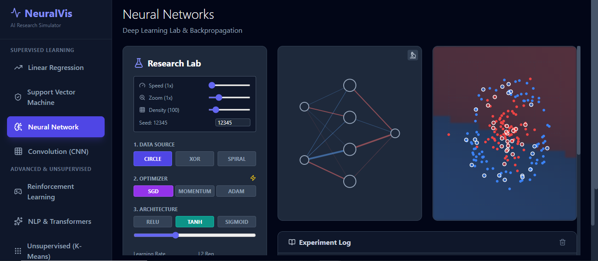

# NeuralVis: AI Math Simulator


## ⭐ GitHub Stars Over Time

[](https://star-history.com/#RajaMuhammadAwais/NeuralVis)

## 🧠 Overview

**NeuralVis** is an interactive, web-based **AI Research Simulator** designed to visualize and demystify complex concepts in **Machine Learning** and **Advanced Mathematics**. Built with a modern React and TypeScript stack, it provides a hands-on environment for exploring the mechanics of various algorithms, from foundational linear regression to cutting-edge transformer models and multivariable calculus.



The project is structured into distinct, self-contained modules, allowing users to focus on specific topics and see the underlying mathematical and algorithmic processes in action.

## ✨ Key Features

NeuralVis is divided into three main categories of interactive modules:

### 1. Supervised Learning

| Module | Description | Key Concepts |
| :--- | :--- | :--- |
| **Linear Regression** | Foundation of supervised learning, visualizing data fitting and error minimization. | Supervised Learning Foundations, Cost Function, Gradient Descent. |
| **Support Vector Machine (SVM)** | Interactive visualization of the maximum margin classifier. | Max Margin Classification, Kernels, Hyperplane. |
| **Neural Networks** | A deep learning lab to explore network architecture and the backpropagation process. | Deep Learning Lab, Backpropagation, Activation Functions. |
| **Convolutional Neural Networks (CNN)** | Demonstrates the mechanics of convolution and feature extraction. | Computer Vision, Feature Extraction, Convolutional Layers. |

### 2. Advanced & Unsupervised Learning

| Module | Description | Key Concepts |
| :--- | :--- | :--- |
| **Reinforcement Learning** | Simulates agent interaction with an environment using Q-Learning. | Q-Learning, Agent Navigation, Exploration vs. Exploitation. |
| **NLP & Transformers** | Visualizes the core mechanism of the Transformer architecture. | Natural Language Processing, Attention Mechanism, LLMs. |
| **K-Means Clustering** | An unsupervised learning module for pattern recognition and data grouping. | Unsupervised Learning, Pattern Recognition, Centroids. |

### 3. Foundational Mathematics

| Module | Description | Key Concepts |
| :--- | :--- | :--- |
| **Calculus** | Visualizes derivatives and rates of change. | Derivatives, Rates of Change, Limits. |
| **Multivariable Calculus** | Focuses on optimization techniques critical for machine learning. | Optimization, Gradient Descent, Partial Derivatives. |
| **Probability** | Explores distributions and the Central Limit Theorem. | Distributions, Central Limit Theorem, Statistical Modeling. |

## 🛠️ Technology Stack

NeuralVis is a modern web application built with the following technologies:

*   **Frontend Framework:** [React](https://react.dev/) (v19.2.0)
*   **Language:** [TypeScript](https://www.typescriptlang.org/)
*   **Build Tool:** [Vite](https://vitejs.dev/) (v6.2.0)
*   **Styling:** [Tailwind CSS](https://tailwindcss.com/) (v3.4.13)
*   **Charting:** [Recharts](https://recharts.org/en-US/)
*   **Math Rendering:** [KaTeX](https://katex.org/)
*   **Data Visualization:** [D3.js](https://d3js.org/)
*   **Icons:** [Lucide React](https://lucide.dev/)

## 🚀 Getting Started

Follow these steps to set up and run the project locally.

### Prerequisites

You will need [Node.js](https://nodejs.org/) (which includes npm) installed on your machine.

### Installation

1.  **Clone the repository:**
    ```bash
    git clone https://github.com/RajaMuhammadAwais/NeuralVis.git
    cd NeuralVis
    ```

2.  **Install dependencies:**
    ```bash
    npm install
    # or
    pnpm install
    ```

### Running the Application

1.  **Start the development server:**
    ```bash
    npm run dev
    # or
    pnpm run dev
    ```

2.  The application will be available at the address shown in your terminal (usually `http://localhost:5173`).

### Building for Production

1.  **Build the project:**
    ```bash
    npm run build
    # or
    pnpm run build
    ```
    The optimized production files will be generated in the `dist` directory.

## 📂 Project Structure

The core logic of the application is organized as follows:

```
NeuralVis/
├── components/           # Reusable UI components (e.g., MathDisplay)
├── modules/              # Core logic for each simulator module
│   ├── CNNModule.tsx
│   ├── CalculusModule.tsx
│   ├── ClusteringModule.tsx
│   ├── LinearRegression.tsx
│   ├── MultivariableModule.tsx
│   ├── NeuralNetwork.tsx
│   ├── ProbabilityModule.tsx
│   ├── ReinforcementModule.tsx
│   ├── SVMModule.tsx
│   └── TransformerModule.tsx
├── utils/                # Utility functions (e.g., math.ts)
├── App.tsx               # Main application layout and module routing
├── index.html            # Entry point
├── package.json          # Dependencies and scripts
└── tsconfig.json         # TypeScript configuration
```

## 🤝 Contributing

Contributions are welcome! If you have suggestions for new modules, improvements to existing visualizations, or bug fixes, please feel free to open an issue or submit a pull request.

## 📄 License

This project is licensed under the **MIT License**. See the `LICENSE` file (if present) or the repository for details.

***

*A project by Raja Muhammad Awais.*
